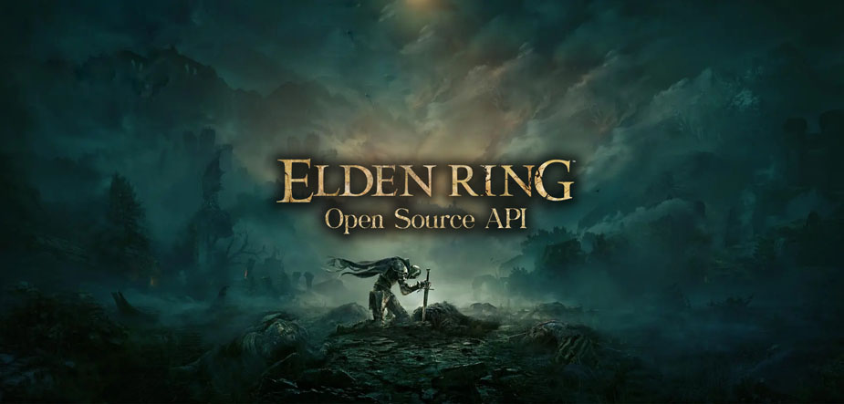

The Elden Ring is a cool open source API that provides information about this amazing game released by FromSoftware in 2022. In this section you will be guided with basics steps on how to properly use this API. This API is open, so it doesn't require an API key to use it. Also, please give us a star on our [official github repository](http://www.github.com/deliton/eldenring-api) and feel free to post issues there.

## Example REQUEST (REST)

Since this API doesn't require you to provide an API key, it's extremely easy to use. Feel free to explore our documentation and test routes! Let's retrieve a list of all released games with the following route:

- METHOD: **GET**
- URL: https://eldenring.fanapis.com/api/items?limit=2

- RESULT

```javascript
{
  success: true,
  count: 2,
  data: [{
      id: "17f69e47912l0i1z0lip3kamll88h",
      name: "Blue Cipher Ring",
      image: "https://eldenring.fanapis.com/images/items/17f69e47912l0i1z0lip3kamll88h.png",
      description: "Item for online play. Puts the wearer in ready state to answer should someone in another world call for rescue. You will be summoned to their world as a hunter. When summoned to rescue another player, your objective will be to defeat the invader.",
      scaling: "Reusable",
      effect: "Enables the wearer to answer calls for rescue"
    },
    {
      id: "17f69cb5ad0l0i1z0lpxlgghg1a5nd",
      name: "White Cipher Ring",
      image: "https://eldenring.fanapis.com/images/items/17f69cb5ad0l0i1z0lpxlgghg1a5nd.png",
      description: "Item for online play. Allows you to automatically request for a hunter from another world to come to your rescue when your world is invaded. (You may be unable to summon rescuers under certain circumstances). A lost mystic code, enchanted to take the form of a ring. One of the fetishes said to have been bestowed by the Two Fingers.",
      scaling: "Reusable",
      effect: "When invaded, request the aid of a hunter."
    }
  ]
}
```

## GraphQL Support

GraphQL is an open-source data query and manipulation language created by Facebook in 2015. It provides a more efficient and scalable way to access and update data compared to traditional REST API endpoints.

GraphQL allows clients to specify the exact data they need from servers, reducing the number of requests and bandwidth needed. Servers can also batch multiple queries into a single request, improving performance. You can get started by visiting https://eldenring.fanapis.com/api/graphql and play around with the data.

## Example REQUEST (GRAPHQL)

Let's retrieve a monster called "Giant Lobster", I want this API to return its `name`, `location` and an `image`. So let's make a POST request with the following GraphQL body:

```json
query {
	creature(name: "Giant Lobster") {
    name,
    location,
    image
  }
}
```

Then the GraphQL API will return:

- RESULT

```javascript
{
  "data": {
    "creature": [
      {
        "name": "Giant Lobster",
        "location": "Liurnia of the Lakes",
        "image": "https://eldenring.fanapis.com/images/creatures/17f69d7f00al0i6ytxittgv1hoa7vg.png"
      }
    ]
  }
}
```

Pretty easy, huh? Go to https://eldenring.fanapis.com/api/graphql and use the data for your project as you like

## Fair Use Policy

Elden Ring API is free and open to use. Because of this, we humbly ask developers to use it fairly and not spam it. This is an educational service so please do not harm others.

## Issues

The data available on this API was scraped from other Elden Ring fansites and wikis. If you find some issue or incorrect data, feel free to open an issue [on this link](https://github.com/deliton/eldenring-api/issues/new)


---
